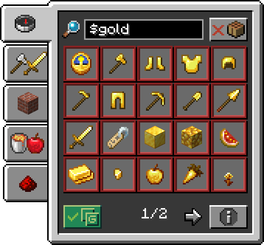
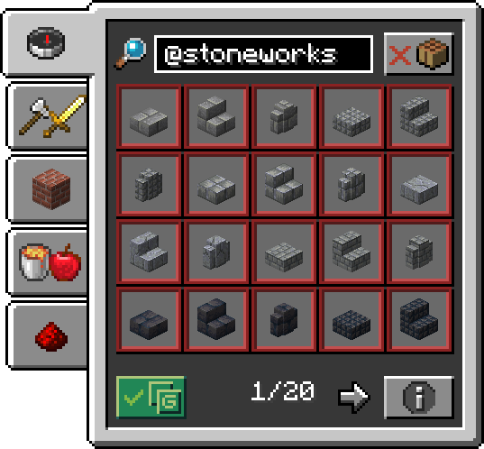
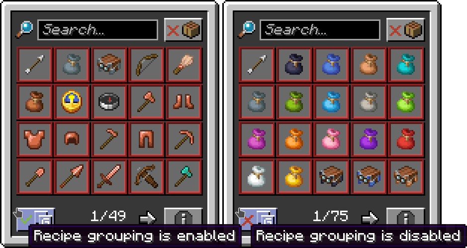
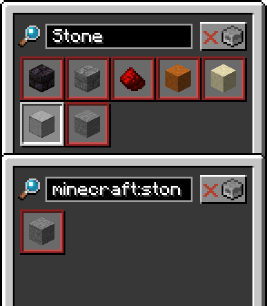

 

<h2>
Collection of QoL tweaks and new features to vanilla recipe book
</h2>

### Features:
<table style="border: none">
<tr><td width="50%">
Item Usages

Allows searching for recipes that use that item as an ingredient. By default, search prefix is "$"
</td><td>

</td></tr>
<tr><td>

</td><td>
Mod search

Allows searching for items from certain mods. By default, search prefix is "@"
</td></tr>
<tr><td>
Recipe grouping toggle

Ever looked at recipes inside the book and wondered why some of them are grouped? Or wanted to see all 16 colors of [Insert colored item here]? Well fret no more, as there is now handy toggle to that behavior!
</td><td>

</td></tr>
<tr><td>

</td><td>
Keybinds

Useful keybinds to ease the process of searching. hover over an item <code>R</code> to input its name into search bar or press <code>U</code> to input it as an ingredient to search for its uses. You can also press <code>M</code> to search for namespace of the mod that adds hovered item. Holding <code>Control</code> while pressing <code>R</code> or <code>U</code> inputs exact item id so you would not search for some other things
</td></tr>
</table>
