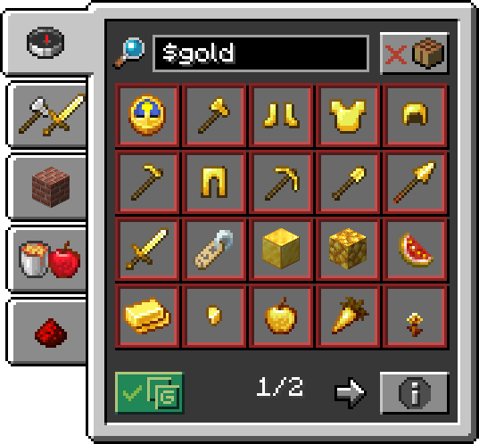
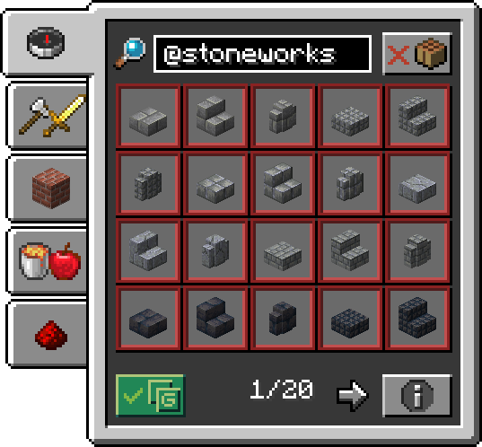
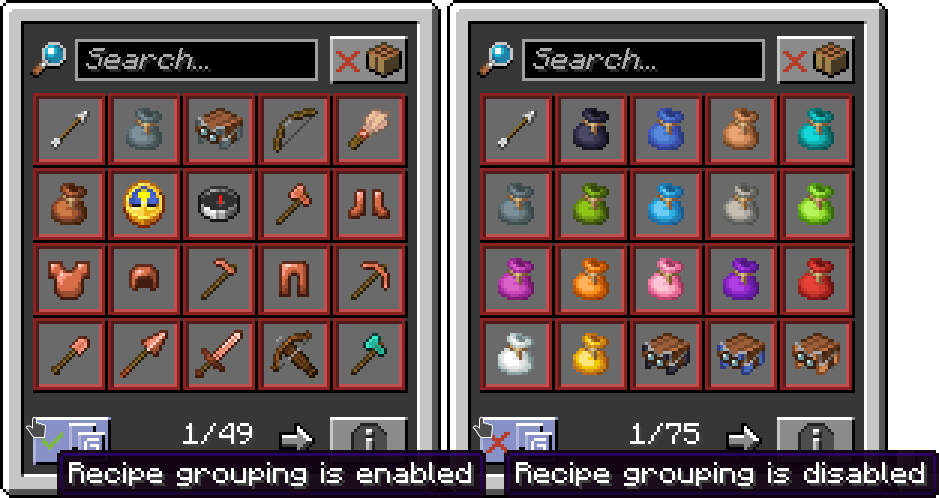
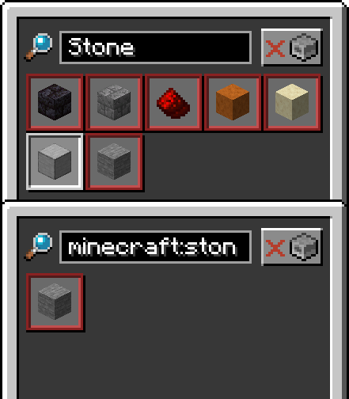
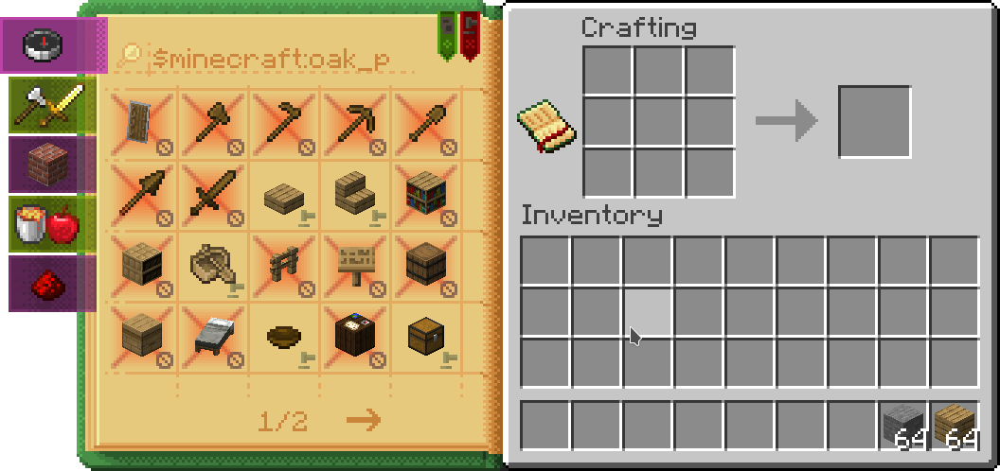

<h2>
Collection of QoL tweaks and new features to vanilla recipe book
</h2>

### Features:
<table style="border: none">
<tr><td width="50%">
Item Usages

Allows searching for recipes that use that item as an ingredient. By default, search prefix is "$"
</td><td>

</td></tr>
<tr><td>

</td><td>
Mod search

Allows searching for items from certain mods. By default, search prefix is "@"
</td></tr>
<tr><td>
Recipe grouping toggle

Ever looked at recipes inside the book and wondered why some of them are grouped? Or wanted to see all 16 colors of [Insert colored item here]? Well fret no more, as there is now handy toggle to that behavior!
</td><td>

</td></tr>
<tr><td>

</td><td>
Keybinds

Useful keybinds to ease the process of searching. hover over an item <code>R</code> to input its name into search bar or press <code>U</code> to input it as an ingredient to search for its uses. You can also press <code>M</code> to search for namespace of the mod that adds hovered item. Holding <code>Control</code> while pressing <code>R</code> or <code>U</code> inputs exact item id so you would not search for some other things
</td></tr>
<tr><td>
New UI

[v1.0.4+] New custom-built ui with fancy recipe book stylization. Boring plain vanilla ui begone! Don't worry, vanilla like ui can be enabled in config ;)
</td><td>

</td></tr>
</table>

### Future

This mod is under development right now and I would love to add many more features. BUT I am quite new to mod development and to Java programming in general so some of those features might never see the light of day.

Right now I have following features in mind:

<ul>
<li> Improved search:
  <ul><li> Allow logic AND and OR to be included in search. This will allow for technical users to combine search parameters for fine tuned searching. (For example searching "block&$diamond" would find any recipe that makes block and has diamond something as an ingredient. Or "@minecraft|@supplementaries" to search for any recipe from minecraft or supplementaries)</li>
  <li> Search optimization and caching. Its not a secret minecrafts native recipe solution isn't optimized and my mod _currently_ isn't that far off. even if vanilla recipes aren't that numerous it may freeze the game on lower end systems as it literally cycles through every recipe to find a match. So Sort and other improvements are in order.</li>
  <li> Tag search. This one is simple. search by tags item may have instead of name or id</li></ul></li>
<li>Favorites (or bookmarked recipes):
  <ul><li> Allow user to bookmark any recipe to find it easier next time. Add a little star in the corner or golden frame idk. Maybe make favorites recipes appear in front of the book on the first page instead of alphabetic sort</li>
  <li>Favorites tab. Or shove them into separate tab. xd</li></ul></li>
<li>Fullscreen recipe book
  <ul><li> Allow user to open book in fullscreen to view recipes not for current workstation akin JEI. No need to place down a furnace to see what smelting recipes user has</li>
<li>Allow viewing all discovered recipes. Alongside it I want to make more perfomant customizable recipe discovery system.</ul></li>
<li>Support other types of stations
  <ul><li> Allow new recipe book locations. Some of those may include: Brewing stand, Smithing Table or some Modded screens that require additional compatibility</li></ul></li>
<li>Support other versions and modloaders
  <ul><li> I want to support main modding versions starting 1.21.1 neoforge and fabric</li></ul></li></ul>
